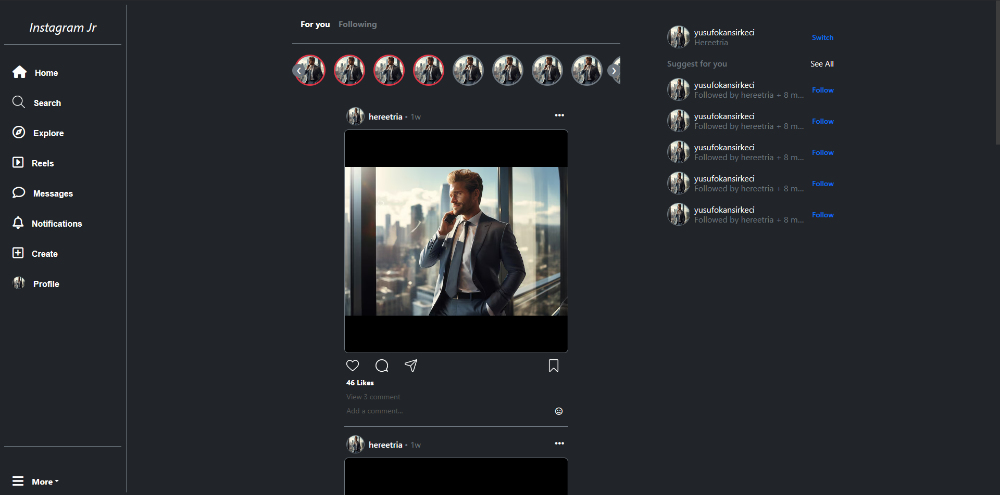
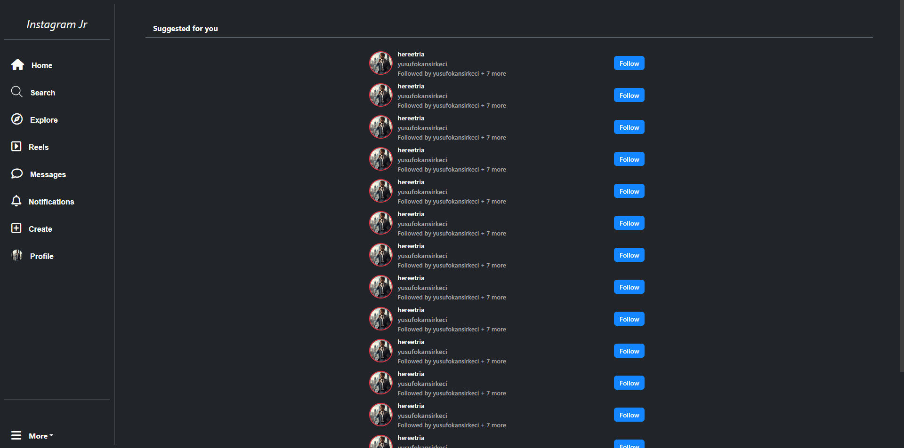

# 📱 Instagram Clone UI Demo — Static Social Media UI Prototype

<br>

[](../../issues/new?labels=bug)
[](../../issues/new?labels=enhancement)

<br>

## 📌 Project Overview

Instagram Clone UI Demo is a **static design prototype** that models the UI of a social media platform by closely mimicking Instagram’s layout and visual structure.  
This project focuses on **frontend design and responsive layout**, without any backend integration.

<br>

## ✨ Features

- Instagram-like **main page layout**  
- **Mainstream** and **See All** pages fully designed  
- **Responsive UI** built with HTML, CSS, and Bootstrap  
- Clean modular structure with separate `src`, `shared`, and `modules` folders  

<br>

## 🖼️ Screenshots
Shown below in order:  
**1. Mainstream** · **2. See All**

<p align="center">
  
  
  
</p>

<br>

## 🧰 Tech Stack

<p>
  
  
  
  
</p>

<br>

## 📥 Installation

### Prerequisites
- Node.js 18+ (for running Lite Server or any static server)

### Setup
```bash
git clone [repository-url]
cd instagram-clone-ui-demo

pnpm install lite-server   # or use npm/yarn if preferred
pnpm start                 # serves the dist folder
```

The `dist` folder contains the prepared static files.  
For development, edit files in `src`.  
- `shared/` contains **exported** code.  
- `modules/` contains **imported** and used files in the project.

<br>

## 📜 License

[](LICENSE)

This project is licensed under the terms described in the [LICENSE](./LICENSE) file.

---

© 2025 Yusuf Okan Sirkeci — [Hereetria](https://github.com/Hereetria)
